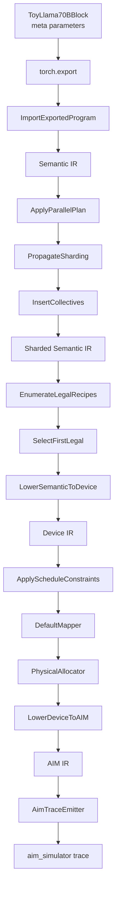

# ALOI v0.1 代码结构与阅读指南

本文说明当前 ALOI v0.1 的代码组织、各模块职责、数据如何穿过编译流水线，以及扩展和调试代码时需要注意的设计边界。

## 1. 一句话理解 ALOI

ALOI 是一个**只处理形状、语义和映射信息，不执行真实大模型计算**的 lowering prototype：

```text
PyTorch 模型结构
  → Semantic IR
  → 张量并行与自动通信
  → Device IR
  → 物理映射
  → AIM IR
  → aim_simulator trace
```

当前系统的目的不是验证 Llama2-70B 的数值正确性或性能，而是验证上述编译链能否在保留必要语义的前提下完整走通。

## 2. 总体流水线

编译流水线的唯一集中入口是 [`aloi/pipeline.py`](../../aloi/pipeline.py)。`compile_exported_program()` 按固定顺序调用各个 pass，并返回每个重要阶段的产物。



`CompilationResult` 保存以下六类结果：

| 字段 | 含义 | CLI 对应文件 |
|---|---|---|
| `exported_program_text` | `torch.export` 图的文本形式 | `exported_program.txt` |
| `semantic` | 全局、未分片的模型语义 | `01_semantic.aloi` |
| `sharded` | TP propagation 和 collective insertion 后的语义 | `02_sharded.aloi` |
| `device` | 完成设备合法化的 IR | `03_device.aloi` |
| `aim` | 带物理映射信息的 AIM IR | `04_aim.aloi` |
| `trace` | AiM simulator 可消费的命令流 | `05_aim.trace` |

## 3. 目录结构

```text
ALOI_dev/
├── aloi/
│   ├── frontend/          # PyTorch custom op、torch.export 和 Semantic IR importer
│   ├── ir/                # 通用 SSA IR、类型、printer 和各层 verifier
│   ├── parallel/          # ParallelPlan、sharding propagation、collective insertion
│   ├── device/            # YAML DeviceSpec
│   ├── lowering/          # recipe registry、selector、Semantic → Device lowering
│   │   └── recipes/       # linear、RMSNorm、attention、elementwise recipe
│   ├── mapping/           # Schedule DSL、默认映射、物理分配
│   ├── backend/aim/       # Device → AIM lowering、ISR 和 trace emitter
│   ├── cli/               # python -m aloi.cli.compile
│   └── pipeline.py        # 固定的 v0.1 pass pipeline
├── examples/llama2_70b/   # 编译器专用 Toy Llama2-70B block
├── configs/devices/       # 目标设备能力与物理参数
├── tests/                 # 单元和端到端测试
├── docs/                  # 执行计划、验证记录和本说明
└── build/                 # demo 生成的 IR 与 trace，不属于源代码
```

## 4. IR 基础设施

### 4.1 核心 SSA 对象

[`aloi/ir/base.py`](../../aloi/ir/base.py) 定义了整个编译器共用的最小 IR：

- `Value`：带名字和 `TensorType` 的 SSA value，并可指向其 producer。
- `Operation`：包含 dialect-qualified op 名、operands、results 和可序列化 attributes。
- `Function`：当前是单基本块、顺序执行的 SSA function。
- `Module`：函数集合和 module-level attributes。
- `Pass`：所有 module transformation 的抽象基类。

当前 IR 有意保持简单，没有控制流、region、block argument 或完整 use-list。`Function.verify()` 主要检查：

- operand 必须在使用前可用；
- SSA 名字不能重复；
- function output 必须来自 input 或已生成的 result。

### 4.2 TensorType

[`aloi/ir/types.py`](../../aloi/ir/types.py) 中的 `TensorType` 是语义传递的核心：

| 字段 | 作用 |
|---|---|
| `shape` | 当前阶段可见的 shape；分片后表示单个 partition 的局部 shape |
| `dtype` | ALOI 规范化后的 dtype，例如 `fp16` |
| `role` | `activation`、`weight`、`kv_cache` 或 `index` |
| `axes` | 每一维的语义名，例如 `batch/token/q_head/head_dim` |
| `persistent` | 是否是跨 decode step 保留的逻辑状态，目前用于 KV cache |
| `sharding` | 分片轴、mesh 轴和 partition 数量 |
| `global_shape` | 分片前的模型级 shape；未分片时为 `None` |

例如，全局 Q tensor 是：

```text
shape = [1, 1, 64, 128]
axes  = [batch, token, q_head, head_dim]
```

TP=8 后，它变为：

```text
shape        = [1, 1, 8, 128]
global_shape = [1, 1, 64, 128]
sharding     = q_head@tp/8
```

这里的关键点是：`shape` 表示当前 partition 真正拥有的局部数据，`global_shape` 保留原始模型语义。

### 4.3 Printer 和 verifier

- [`aloi/ir/printer.py`](../../aloi/ir/printer.py) 将所有 IR 层打印为统一、确定性的 `.aloi` 文本。
- [`aloi/ir/semantic.py`](../../aloi/ir/semantic.py) 定义合法的 `aloi.*` op 集合，并阻止物理设备概念进入 Semantic IR。
- [`aloi/ir/device.py`](../../aloi/ir/device.py) 要求 Device IR op 只能来自 `pim.*`、`pnm.*`、`cxl.*` 或 `device.*`。
- [`aloi/ir/aim.py`](../../aloi/ir/aim.py) 要求 AIM IR op 全部使用 `aim.*` 前缀。

这些 verifier 是阶段边界检查，不是完整的类型系统或设备合法性证明器。

## 5. Frontend：从 Toy Llama 到 Semantic IR

### 5.1 ToyLlama70BBlock

[`examples/llama2_70b/model.py`](../../examples/llama2_70b/model.py) 描述一个 decoder block，包含：

- attention RMSNorm；
- Q/K/V projection；
- RoPE；
- 函数式 KV-cache update；
- GQA attention；
- output projection 和 residual；
- FFN RMSNorm；
- SwiGLU；
- FFN output projection 和 residual。

它保留真实 Llama2-70B shape，但所有 parameter 和 example input 都位于 `meta` device。它们有逻辑 shape 和 dtype，却没有实际数据指针，因此不会分配数 GB 的权重，也不会执行真实 GEMV。

配置在 [`examples/llama2_70b/config.py`](../../examples/llama2_70b/config.py)：

```text
hidden_size         = 8192
attention heads     = 64
KV heads            = 8
head_dim            = 128
intermediate_size   = 28672
layers              = 1
```

### 5.2 Custom ops

[`aloi/frontend/custom_ops.py`](../../aloi/frontend/custom_ops.py) 注册四个稳定的 frontend contract：

- `aloi::linear`
- `aloi::rms_norm`
- `aloi::rope`
- `aloi::kv_update`

每个 op 都有 FakeTensor kernel。kernel 只构造输出 metadata，不进行矩阵乘、归一化、RoPE 或 cache 写入。较简单的算子仍使用普通 PyTorch op，例如 `matmul`、`add`、`mul`、`softmax`、`reshape`、`transpose` 和 `expand`。

### 5.3 Export 和 import

[`aloi/frontend/torch_export.py`](../../aloi/frontend/torch_export.py) 的 `export_model()`：

1. 验证所有输入和 parameter 都在 `meta` device；
2. 调用严格模式的 `torch.export.export()`；
3. 返回 `ExportBundle`。

[`aloi/frontend/importer.py`](../../aloi/frontend/importer.py) 的 `ImportExportedProgram` 随后：

1. 遍历 exported FX graph；
2. 将 PyTorch/custom-op target 映射到 `aloi.*` op；
3. 读取 FakeTensor shape 和 dtype；
4. 根据 parameter、shape 和 dataflow 推导 `role`、`axes` 与 `semantic_name`；
5. 将 tuple result 和 `operator.getitem` 恢复为多结果 SSA op；
6. 运行 canonicalization 和 metadata 完整性检查。

`semantic_name` 是后续 pass 识别逻辑算子的主要锚点，例如：

```text
attention.q
attention.k
attention.output
feed_forward.gate
feed_forward.down
```

## 6. 张量并行和自动通信

### 6.1 ParallelPlan 只描述 ownership

[`aloi/parallel/plan.py`](../../aloi/parallel/plan.py) 中的 `ParallelPlan` 只允许声明：

```python
plan.shard("attention.q", axis="q_head", mesh_axis="tp")
```

它没有 `all_reduce()` API，这是有意的设计：用户声明 tensor ownership，通信由编译器根据算子语义推导。

参考计划位于 [`examples/llama2_70b/parallel_plan.py`](../../examples/llama2_70b/parallel_plan.py)，它对 Q head、KV head 和 FFN intermediate dimension 进行分片。

### 6.2 Sharding propagation

[`aloi/parallel/propagation.py`](../../aloi/parallel/propagation.py) 在 dataflow 中传播分片：

- 在 reshape/transpose/expand 等 layout op 两侧传播；
- 在 RoPE 的 Q/K 对应输入输出间传播；
- 将新 K/V 的 `kv_head` 分片传播到 persistent cache；
- 沿 attention matmul 和 elementwise op 传播 head ownership；
- 将 projection output sharding 转换为 weight 的 `out_feature` sharding；
- 当 linear 的 input feature 已分片而 output 未分片时，标记 `partitioned_reduction`。

TP=8 的关键结果：

| Tensor | 全局 | 单 partition |
|---|---:|---:|
| Q heads | 64 | 8 |
| KV heads | 8 | 1 |
| FFN intermediate | 28672 | 3584 |

### 6.3 Collective insertion

[`aloi/parallel/collectives.py`](../../aloi/parallel/collectives.py) 查找 `partitioned_reduction`，并在对应结果后插入 `aloi.all_reduce`。

当前 block 会自动生成两个 all-reduce：

- attention `Wo` projection 之后；
- FFN `W2` projection 之后。

因此 `ParallelPlan` 中没有通信指令，但 `02_sharded.aloi` 中可以看到派生出的通信。

## 7. Semantic IR 到 Device IR

### 7.1 DeviceSpec

[`aloi/device/spec.py`](../../aloi/device/spec.py) 读取 [`configs/devices/cent.yaml`](../../configs/devices/cent.yaml)。YAML 同时描述：

- op 是否受支持；
- 支持的 dtype；
- GEMV vector width；
- channel、bank group、row 和 global buffer 等物理参数。

`DeviceSpec.supports()` 是 v0.1 recipe legality 的唯一判断依据。当前没有 cost model，也不会比较多个合法方案的性能。

### 7.2 Recipe registry

[`aloi/lowering/registry.py`](../../aloi/lowering/registry.py) 定义：

- `LoweringRecipe`：`match()`、`is_legal()` 和 `lower()` 接口；
- `LoweringRecipeRegistry`：保存所有候选 recipe；
- `EnumerateLegalRecipes`：枚举 capability 合法的候选；
- `LowerSemanticToDevice`：实际重建 Device IR SSA graph。

[`aloi/lowering/selector.py`](../../aloi/lowering/selector.py) 的 `FirstLegalSelector` 按注册顺序选择第一个合法 recipe。

内置 recipe 分布如下：

| 文件 | 主要 lowering |
|---|---|
| `recipes/linear.py` | `aloi.linear → pim.gemv` |
| `recipes/rmsnorm.py` | RMSNorm 分解为 PIM elementwise、transfer、PNM reduction/rsqrt |
| `recipes/attention.py` | RoPE、KV update、matmul、softmax → PNM |
| `recipes/elementwise.py` | add/mul、layout op 和 collective |

RMSNorm 是跨设备 lowering 的代表：

```text
aloi.rms_norm
  → pim.ewmul
  → device.transfer
  → pnm.reduce_sum
  → pnm.rsqrt
  → device.transfer
  → pim.ewmul
```

完成这一阶段后，不应再存在作为 operation 的 `aloi.*` compute op。

## 8. Mapping DSL 和物理分配

### 8.1 Schedule 是 partial constraint

[`aloi/mapping/schedule.py`](../../aloi/mapping/schedule.py) 提供：

```text
split, tile, place, replicate,
shard, bind, reduce_at, pipeline
```

参考 schedule 位于 [`examples/llama2_70b/schedule.py`](../../examples/llama2_70b/schedule.py)：

```python
with schedule("attention.wq") as q_schedule:
    q_schedule.tile("in_feature", factor=256)
    q_schedule.bind("out_feature", "channel")
    q_schedule.place("weight", "pim")
```

用户不需要填写完整映射。`Schedule` 只表达必须满足的约束。

### 8.2 三个映射阶段

1. [`ApplyScheduleConstraints`](../../aloi/mapping/plan.py) 将 schedule target 匹配到 Device IR op。
2. [`DefaultMapper`](../../aloi/mapping/default_mapper.py) 确定性地补齐没有指定的 tile、placement、binding 等信息。
3. [`PhysicalAllocator`](../../aloi/mapping/allocator.py) 分配 channel group、bank group、DRAM row range 和 global-buffer range。

v0.1 没有搜索、autotuning 或 cost comparison。同样输入、设备配置和 schedule 应得到同样的映射结果。

需要注意：`03_device.aloi` 是刚完成设备合法化的快照；mapping 后的物理信息主要出现在 `04_aim.aloi` 中。

## 9. AIM backend 和 trace

### 9.1 Device → AIM

[`aloi/backend/aim/lowering.py`](../../aloi/backend/aim/lowering.py) 将已分配的 Device IR 转为 AIM SSA IR。

一个 `pim.gemv` 会展开为：

```text
aim.view                 # weight 的物理 tile view
aim.load_gb              # activation 加载到 global buffer
aim.pim.mac_dram_gb      # DRAM weight × GB activation
aim.read_acc             # 读取 accumulator
```

其他 device operation 分别变为 `aim.pim.*`、`aim.pnm.*`、`aim.cxl.*` 或 `aim.transfer`。每个 AIM operation 都继承 mapping 和 physical attributes，方便检查 lowering 是否保留物理决策。

### 9.2 ISR 和 trace emitter

[`aloi/backend/aim/isr.py`](../../aloi/backend/aim/isr.py) 定义带 operand arity 检查的 AiM 指令对象。

[`aloi/backend/aim/trace_emitter.py`](../../aloi/backend/aim/trace_emitter.py) 的策略是：

- PIM AIM op → 真实 `WR_GB`、`MAC_ABK`、`RD_MAC`、`EWMUL` 或 `EWADD` 命令；
- PNM AIM op → `# ALOI_PNM ...` 注释；
- CXL AIM op → `# ALOI_CXL ...` 注释；
- transfer → `# ALOI_TRANSFER ...` 注释；
- trace 最后追加 `AiM EOC`。

PNM/CXL 只变成注释并不意味着语义在编译器中丢失。完整信息仍存在于 AIM IR；只是当前 `aim_simulator` 仅消费 PIM 命令。未来的分析 backend 可以读取 `aim.pnm.*` 和 `aim.cxl.*` 并加入时间模型。

## 10. CLI 如何组装所有输入

[`aloi/cli/compile.py`](../../aloi/cli/compile.py) 接收：

- model example 目录；
- compile-time `seq_len`；
- TP degree；
- DeviceSpec YAML；
- 可选 schedule Python 文件；
- IR dump 和输出目录选项。

参考命令：

```bash
python -m aloi.cli.compile \
  examples/llama2_70b \
  --seq-len 2048 \
  --tp 8 \
  --device configs/devices/cent.yaml \
  --schedule examples/llama2_70b/schedule.py \
  --dump-ir \
  --output build/
```

example 目录通过两个约定入口接入 CLI：

- `export.py` 提供 `export_block(seq_len)`；
- `parallel_plan.py` 提供 `make_parallel_plan(tp)`。

## 11. Operation attributes 如何逐阶段积累

理解 attributes 的来源有助于阅读 `.aloi` 文件：

| Attribute | 首次产生阶段 | 含义 |
|---|---|---|
| `semantic_name` | frontend importer | 稳定的模型逻辑身份 |
| `weight` | frontend importer | linear 使用的 parameter 名 |
| `arguments` | frontend importer | 从 FX node 保留的常量参数 |
| `partitioned_reduction` | sharding propagation | 本地结果只是 reduction partial |
| `mesh_axis` / `reduction` | collective insertion | collective 的通信语义 |
| `recipe` | device lowering | 被选择的 lowering recipe |
| `source_op` | device lowering | 对应的原始 semantic op |
| `mapping` | default mapping | 完整 mapping decision |
| `physical` | physical allocation | channel、bank、row、GB 和 tile |
| `source_device_op` | AIM lowering | 对应的 Device IR op |

`semantic_name` 会一直向后保留，因此看到 `aim.pim.mac_dram_gb` 时仍可判断它来自 `attention.q` 还是 `feed_forward.down`。

## 12. 推荐的阅读和调试顺序

第一次阅读代码时，建议按下面顺序：

1. 阅读 [`examples/llama2_70b/model.py`](../../examples/llama2_70b/model.py)，理解被编译的 dataflow。
2. 阅读 [`aloi/pipeline.py`](../../aloi/pipeline.py)，获得 pass 顺序的全局视图。
3. 阅读 [`aloi/ir/base.py`](../../aloi/ir/base.py) 和 [`aloi/ir/types.py`](../../aloi/ir/types.py)，理解所有阶段共享的数据结构。
4. 对照 `build/01_semantic.aloi` 与 `build/02_sharded.aloi`，观察 shape、sharding 和 all-reduce 的变化。
5. 对照 `build/03_device.aloi` 与 `build/04_aim.aloi`，观察 recipe legalization 和物理属性。
6. 最后阅读 `build/05_aim.trace` 和 trace emitter。

定位问题时，可以根据第一个异常产物缩小范围：

| 现象 | 优先检查 |
|---|---|
| `torch.export` 失败 | custom-op fake kernel、meta input、model 中是否出现 data-dependent control flow |
| Semantic IR shape/axes 错误 | importer 的 target mapping 和 `_infer_axes()` |
| TP 局部 shape 错误 | plan target、axis 名和 `PropagateSharding` |
| 缺少或多出 all-reduce | `partitioned_reduction` 标记和 `InsertCollectives` |
| 某 op 没有合法 lowering | DeviceSpec capability 和 registry 中是否注册 recipe |
| schedule target 不匹配 | `semantic_name`、weight alias 和 `ApplyScheduleConstraints` |
| AIM lowering 报缺少 physical mapping | 是否遗漏 DefaultMapper 或 PhysicalAllocator |
| simulator 不接受 trace | ISR operand 数量、channel mask、row、EOC |

## 13. 如何扩展

### 13.1 增加 semantic op

通常需要同时修改：

1. frontend importer 的 target mapping；
2. `SEMANTIC_OPS`；
3. role/axes 或 semantic-name 推导；
4. sharding propagation 规则；
5. 至少一个 lowering recipe；
6. DeviceSpec capability；
7. AIM lowering或 trace emission规则；
8. 对应的阶段测试。

### 13.2 增加 lowering candidate

实现新的 `LoweringRecipe`，声明 required capabilities，然后在 `default_registry()` 中注册。v0.1 会选择注册顺序中的第一个合法 candidate；如果未来引入 cost model，可以替换 selector，而不需要改变 recipe 接口。

### 13.3 增加目标设备

新增 DeviceSpec YAML，并保证所需 recipe capability 都存在。若设备需要新的 Device IR 或 AIM op，还要扩展相应 verifier、backend lowering 和 emitter。

### 13.4 增加模型 example

新目录至少需要提供 `export.py` 和 `parallel_plan.py` 的约定入口。若希望使用 CLI schedule，再提供 `schedule.py`。模型应继续使用 meta/FakeTensor 路径，避免编译时创建真实权重。

## 14. 测试结构

| 测试文件 | 覆盖范围 |
|---|---|
| [`tests/test_ir.py`](../../tests/test_ir.py) | 基础 IR、printer、TensorType sharding |
| [`tests/test_frontend.py`](../../tests/test_frontend.py) | 真实 shape、meta 参数、torch.export、Semantic import、KV cache |
| [`tests/test_parallel_lowering.py`](../../tests/test_parallel_lowering.py) | TP ownership、自动 collective、Device/AIM legalization |
| [`tests/test_mapping_trace_cli.py`](../../tests/test_mapping_trace_cli.py) | schedule、trace 命令和注释、CLI 六个产物 |

常用验证命令：

```bash
python -m unittest discover -s tests -v
mypy aloi examples tests
ruff check aloi examples tests
ruff format --check aloi examples tests
```

项目已在 Anaconda `cent` 环境中验证；详细记录见 [`docs/validation.md`](../validation.md)。

## 15. 当前边界和非目标

阅读代码时应牢记以下限制是 v0.1 的设计选择，而不是遗漏：

- 不加载真实 checkpoint，也不执行数值计算；
- 只有一个 decoder block，没有 embedding、LM head 或 80 层模型；
- 只支持 batch=1、decode token=1 和 compile-time sequence length；
- 没有动态 shape、prefill 或 paged attention；
- 没有完整 IR type verifier 或 interpreter；
- 没有 mapping search、cost model 或 autotuning；
- 不计算 PNM/CXL timing；
- 不验证输出是否与 HuggingFace 或 CENT 数值一致；
- trace compatibility 只要求 AiM simulator 能解析和运行 PIM 命令。

这些边界使当前实现可以集中回答三个架构问题：frontend 是否保留了足够的模型语义、ownership 是否足以推导通信，以及设备能力与 mapping constraint 是否可以系统地生成物理 AIM 命令。
